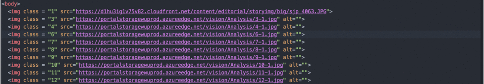

# Altify

Altify automizes the task of inserting alternative text attributes for imgage tags. Altify uses Microsoft Computer Vision API's deep learning algorithms to caption images in an HTML file and returns a new HTML file in which alt attributes are filled out with their corresponding captions.

## Dependencies

- BeautifulSoup
- Python 2.7
- html5lib

## Install and Usage

### 1) Get a Microsoft API Key for Free
[https://www.microsoft.com/cognitive-services/en-us/sign-up](https://www.microsoft.com/cognitive-services/en-us/sign-up "API Key").

### 2) Install via pip

Open up terminal and enter: `pip install altify`

### 3) Use

`altify.py path_to_your_html api_key`

### 4) Enjoy!

A new HTML file is created in your Desktop.

## How It was Built

1. Parses the html using BeautifulSoup.
2. Find all the image tags.
3. Stream images using uploads.im API, and then with its URL, send request to Microsoft's API to caption.
4. Filter images that are smaller than 200px width.
4. Fill out the alt attributes for all the images.
5. Write the edited HTML to the Desktop.

## Captioned Images Samples

A piano keyboard

A squirrel eating

A close up of a cat looking at the camera

A woman wearing a red hat

A small boat in a lake surrounded by mountains

## Disclaimer

Humans are currently better at captioning images than machines. Use responsibly!
